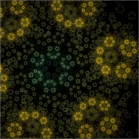
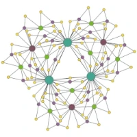
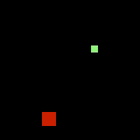

### Hi there 👋

You found the collection of my spare time projects.

:black_nib: To get more than just the bare code, you can read about most of them in my blog [blog.schawe.me](https://blog.schawe.me/).

:scientist: There might also be some code related to my research. You can find further information at [academic.schawe.me](https://academic.schawe.me/de/).

:art: And here is a selection of the products of my code:

<!--
**surt91/surt91** is a ✨ _special_ ✨ repository because its `README.md` (this file) appears on your GitHub profile.

Here are some ideas to get you started:

- 🔭 I’m currently working on ...
- 🌱 I’m currently learning ...
- 👯 I’m looking to collaborate on ...
- 🤔 I’m looking for help with ...
- 💬 Ask me about ...
- 📫 How to reach me: ...
- 😄 Pronouns: ...
- ⚡ Fun fact: ...
-->
